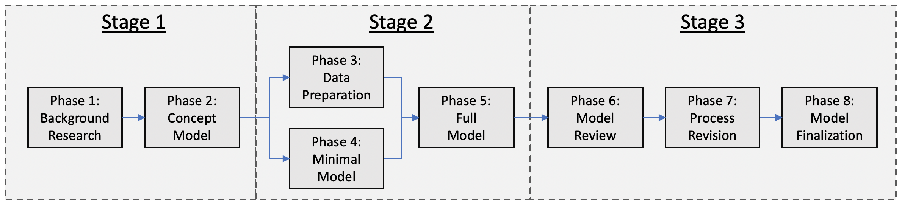

# Model Development
The modeling process is designed to occur in nine phases, 
with responsibility migrating among the Data Analysts, the Researchers, 
and the Software Development team. Ideally, one of each (a Researcher, 
an Analyst, and a Software Developer) will be assigned to each model.

## Generic Modeling Process

##Intervention Report 
The Intervention Report is intended as a living record of model status. It contains the major decisions and rationale as they exist at the end of each phase.

## Intervention Report Template

[Report Template](./docs_andTemplates/Intervention_Report_Template.pdf)

Example Intervention Report

[Report Example](./docs_andTemplates/Intervention_Report_Example.pdf)

# Model Development Workflow
The team has developed an eight phase model development workflow with phase-specific outputs.

## Roles
### Researcher
The Researcher leads the model development process by guiding the background research, conceptualizing possible modeling strategies, validating those strategies with domain experts, guiding the conceptual development of software that will run the model, and generating analytics for model inputs and outputs. The researcher may develop tools in support of these processes.

### Engineer
The Engineer produces all of the code to run the model, including the development of model components and observers, as well as the development of tools in support of model and input data analytics.

## Phase Descriptions
### Phase 1: Background Research
Complete a Systematic Search and generate a ROUGH first draft of the Intervention Report.
[More about Background Research](phase1.md)

### Phase 2: Concept Model Development
Complete a Systematic Review and a Concept Model Document. 
[More about Concept Models](phase2.md)

### Phase 3: Data Extraction and Minimal Modeling
Generate a Data Artifact and update the Intervention Report to include the current status. 
[More about Data Processing](phase3.md)

### Phase 4: Minimal Simulation Model Implementation
This phase can progress simultaneously with Phase 3. 
[More about Minimal Model](phase4.md)

### Phase 5: Full Model Implementation
Add non-minimal components, validate results, and iteratively update until a final model is created. 
[More about Full Model](phase5.md)

### Phase 6: Simulation Model Review
Results are presented to the full team for final validation. 
[More about Model Review](phase6.md)

### Phase 7: Process Revision
The team discusses methods for iterative workflow improvement and brainstorms new tools facilitate future model development. 
[More about Process Revision](phase7.md)

### Phase 8: Finalization
Models are archived and published. 
[More about Finalization](phase8.md)

### Phase 9: Celebration
Pat self on back. Maybe get ice cream. 

